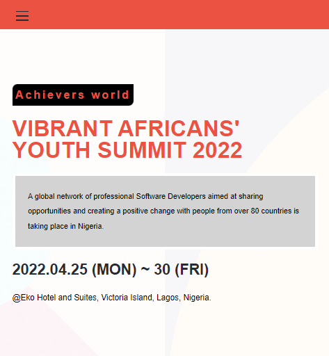

# Capstone-Project

# Mobile-Design

This my Capstone Project in the Microverse curriculum.

## Built With

- HTML
- CSS
- GitHub

## Live Demo

[Live Demo Link](https://aburayhaan.github.io/Viable-Project/)

## Getting Started

To get a local copy up and running:

1. Clone this repository or download the Zip folder:

**``git clone https://github.com/AbuRayhaan/Mobile-Website``**

1. Navigate to the location of the folder in your machine:

**``you@your-Pc-name:~$ cd <folder>``**

## Author

👤 **Hammed Adisa**

- Github: [@AbuRayhaan](https://github.com/AbuRayhaan)

- LinkedIn: [Adisa Hammed](https://www.linkedin.com/in/hammed-adisa-mct-ccsp-ctp-b4378372/)

## Design By

👤 **Cindy Shin**

- Behance: https://www.behance.net/gallery/29845175/CC-Global-Summit-2015

## Contributing

Contributions, issues, and feature requests are welcome!

## Show your support

Give a ⭐ if you like this project and how we manage to build it!

## 📝 License

This project is [MIT](./MIT.md)
